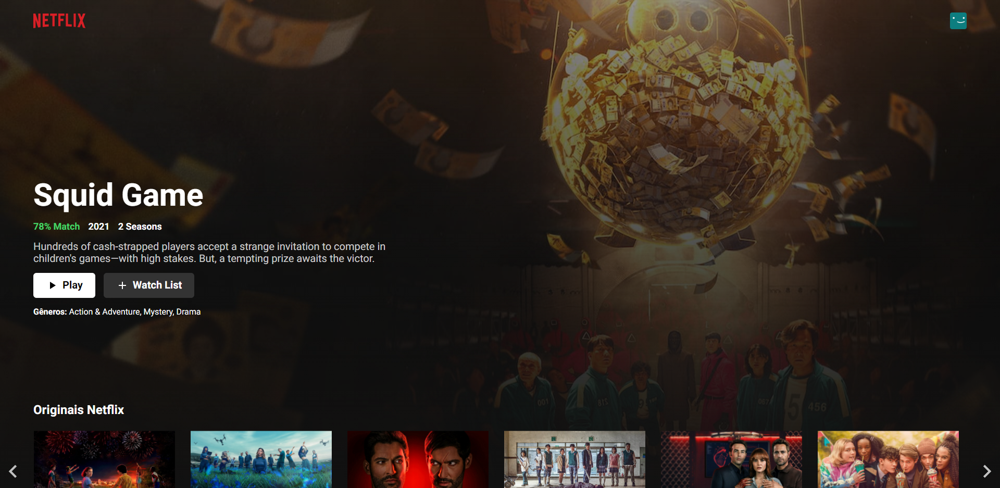

## Project

This project served to practice the basic concepts of NextJS and TypeScript through an interface replication.

## Technologies

This project was developed with the following technologies:

- [React](https://reactjs.org)
- [NextJS](https://nextjs.org/)
- [TypeScript](https://www.typescriptlang.org/)

## How To Use

To clone and run this application, you'll need [Git](https://git-scm.com), [NodeJS](https://nodejs.org/) + [Yarn](https://yarnpkg.com/) installed on your computer.

From your command line:

```bash
# Clone this repository
$ git clone https://github.com/joeldorosarioo/netflix-redesign.git

$ cd netflix-redesign

# Install dependencies

$ yarn

# Start the application

$ yarn dev
```

## How to contribute

- Make a fork;
- Create a branck with your feature: `git checkout -b my-feature`;
- Commit changes: `git commit -m 'feat: My new feature'`;
- Make a push to your branch: `git push origin my-feature`.

After merging your receipt request to done, you can delete a branch from yours.

## License

This project is under the MIT license. See the [LICENSE](/LICENSE) for details.

Made with ♥ by Joel Oliveira. [Get in touch!](https://www.linkedin.com/in/joeldorosarioo/)
